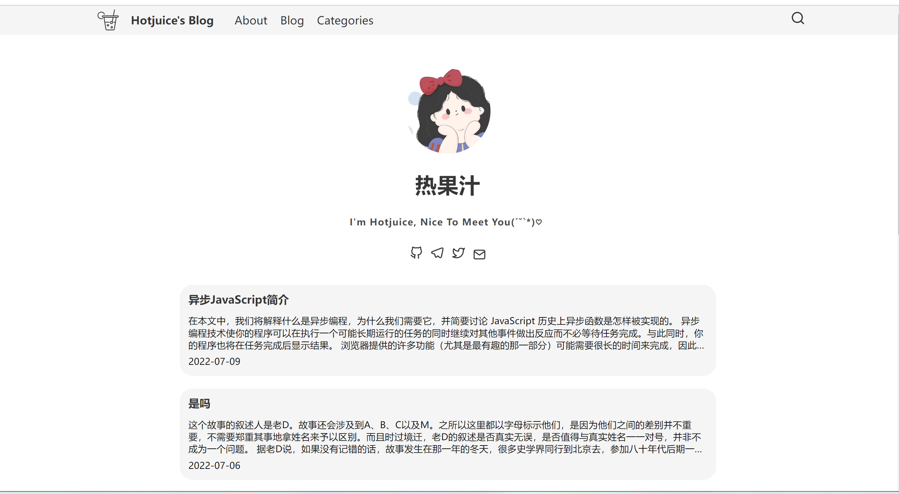
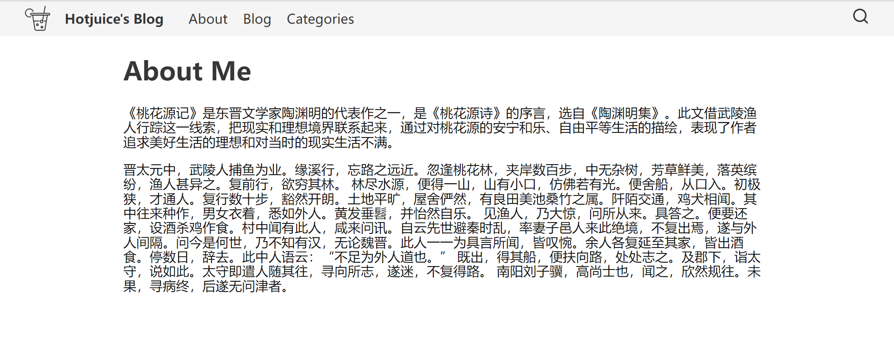
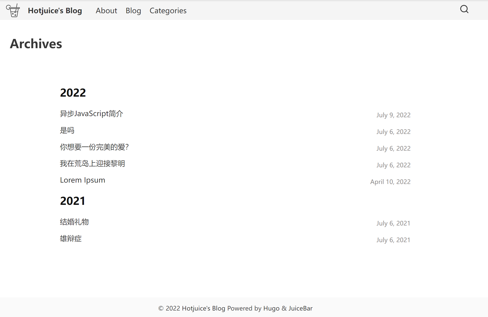
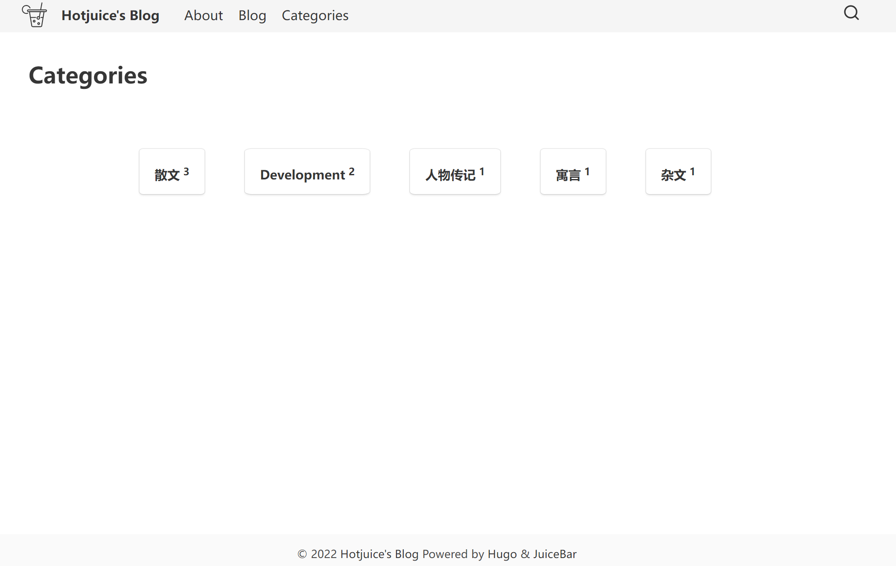
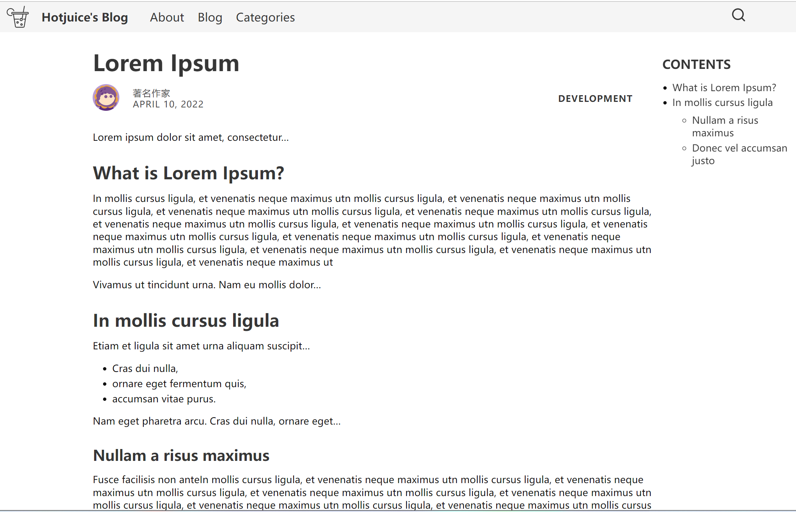

# hugo-JuiceBar
Personal blog theme powered by [Hugo](https://gohugo.io).










## Installation

You can install the theme either as a clone or submodule.

I recommend the latter. From the root of your Hugo site, type the following:

```
$ git submodule add https://github.com/hotjuicew/hugo-JuiceBar.git themes/JuiceBar
$ git submodule init
$ git submodule update
```

Now you can get updates to hugo-JuiceBar in the future by updating the submodule:

```
$ git submodule update --remote themes/JuiceBar
```
## Configuration

After installation, take a look at the `exampleSite` folder inside `themes/hugo-JuiceBar`.

To get started, copy the `config.toml` file inside `exampleSite` to the root of your Hugo site:

```
$ cp themes/hugo-JuiceBar/exampleSite/config.toml .
```

Now edit this file and add your own information. Note that some fields can be omitted.

I recommend you use the theme's archetypes so now delete your site's `archetypes/default.md`.
### Syntax highlighting

The theme supports syntax highlighting thanks to [highlight.js](https://highlightjs.org).

It's disabled by default, so you have to enable it by setting `highlight` to `true` in your config.

You can change the style used for the highlighting by using the `highlightStyle` field.

Only the "common" languages will be loaded by default. To load more, use `highlightLanguages`.

A list of all the available styles and languages can be found [here](https://highlightjs.org/static/demo/).

Please note the style and languages should be written in hyphen-separated lowercase, for example:

```toml
[params]
    highlight = true
    highlightStyle = "solarized-dark"
    highlightLanguages = ["go", "haskell", "kotlin", "scala", "swift"]
```
